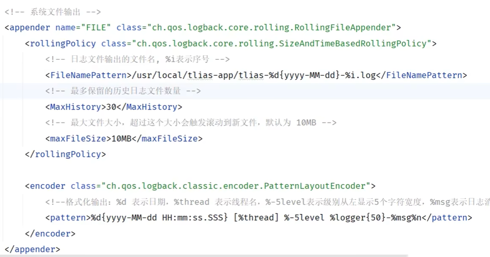

## 操作系统

- 桌面操作系统
  - Windows:用户多
  - MacOS:操作体验好
  - Linux:用户少
- 服务器操作系统
  - Unix:安全,稳定,付费
  - Linux:安全,稳定,免费
  - Windows Server:付费
- 移动设备操作系统
  - Android:基于Linux,开源
  - IOS:苹果
  - HarmonyOS:华为,开源
- 嵌入式操作系统

## Linux

### 目录结构

- **/**是所有目录的顶点
- 其目录结构像树

|   目录    | 存储                                    |
| :-------: | --------------------------------------- |
|   /bin    | 存放二进制文件                          |
|   /boot   | 存放系统引导时使用的文件                |
|   /dev    | 存放设备文件                            |
| **/etc**  | 存放系统配置文件                        |
|   /home   | 存放系统用户的文件                      |
|   /lib    | 存放系统运行所需的共享库和内核模块      |
|   /opt    | 额外安装的可选应用程序包所放置的位置    |
| **/root** | 超级用户目录                            |
|   /sbin   | 存放二进制可执行文件                    |
|   /tmp    | 存放临时文件                            |
| **/usr**  | 存放系统应用程序                        |
|   /var    | 存放运行时需要改变数据的文件,如日志文件 |

### 常用命令

#### 	命令基本格式及快捷键

```shell
command [-options] [parameter]
```

command :命令名

[-options] :选项,用于对命令进行控制

[parameter] :参数

- tab自动补全
- 连按两次tab输出提示操作
- ↑↓调出历史命令
- clear命令或Ctrl+I快捷键

```shell
echo 1 >> 1.txt
#直接输出1至1.txt末尾
#echo:直接输出
#>>:追加重定向
```


#### 目录操作命令

##### ls

```shell
#显示指定目录下的内容
ls [-al] [dir]
```

- **-a**:显示所有文件及目录
- **-l**:列出文件详细信息1
- 简写**ls -l** -> **ll**

##### cd

```shell
#切换目录
cd [dirName]
```

- ~	表示用户home目录
- .         表示当前所在目录
- ..        表示当前目录位置的上级目录
- -表示切换到上一次所在目录

##### mkdir

```shell
#创建目录
mkdir [-p] dirName
```

- -p	确保目录名称存在,不存在则创建,支持多级目录的创建

##### rm

```shell
#删除文件及目录
rm [-rf] name
```

- -r	将目录及目录中的所有文件逐一删除
- -f        无需确认,直接删除

#### 文件操作命令

##### cat

```shell
#一次性查看文件内容
cat [-n] fileName
```

- -n	显示行号

##### more

```shell
#以分页形式显示文件内容
more fileName
```

- enter	向下滚行
- space       向下滚屏
- b               返回上一屏
- q/ctrl+c      退出

##### head

```shell
#查看文件开头内容
head [-n] fileName
```

##### tail

```shell
#查看文件末尾内容
tail [-f] fileName
```

- -f	动态显示文件末尾内容并显示,通常用于日志输出

#### 拷贝移动命令

##### cp

```shell
#复制文件及目录
cp [-r] source dest
```

- -r	将该文件夹及其子文件一同复制

##### mv

```shell
#改名或移动文件及目录
mv source dest
```

#### 打包压缩命令

##### tar

```shell
#对文件进行打包/解包/压缩/解压
tar [-zcxvf] fileName [files]
```

- **.tar**表示只完成打包,不进行压缩
- **.tar.gz**表示打包并压缩
- -z         即表示gzip,指对文件的解压缩操作
- -c         指打包操作
- -x         指解包操作
- -v         显示执行过程
- -f          指定打包后包文件的名称

#### 文件编辑命令

##### vi

```shell
#对文件进行编辑
vi fileName
```

##### vim

```shell
#vi的功能增强
vim fileName
```

- vim由vi发展而来的文本编辑工具,可以对文本内容进行着色
- 要想使用vim命令需要进行安装:**yum install vim**

**文本编辑模式**

- 命令模式

  - 进入:默认

  - 指令:

    | 命令模式指令 | 含义                        |
    | :----------: | --------------------------- |
    |      gg      | 定位到文本内容第一行        |
    |      G       | 定位到文本内容最后一行      |
    |      dd      | 删除光标所在行              |
    |     ndd      | 删除光标所在行及之后n行数据 |
    |      u       | 撤销操作                    |
    |    i/a/o     | 进入插入模式                |

- 插入模式

  - 进入:命令模式输入i/a/o

  - 指令:

    esc     返回命令模式

- 底行模式

  - 进入:命令模式按下:或/进入

  - 指令:

    | 底行模式指令 | 含义        |
    | :----------: | ----------- |
    |     :wq      | 保存并退出  |
    |     :q!      | 不保存退出  |
    |   :set nu    | 显示行号    |
    |  :set nonu   | 不显示行号  |
    |      :n      | 定位到第n行 |

#### 查找命令

##### find

```shell
在指定目录下查找指定文件
find dirName -option fileName
```

##### grep

```shell
从指定文件中查找指定的文本内容
grep [-inAB] word fileName
```

- -i	检索关键字忽略大小写
- -n       显示关键字所在的行号
- -An     输出关键字及关键字后n行
- -Bn     输出关键字及关键字前n行

### 软件安装

#### 安装方式

- 二进制发布包安装

  仅需解压,修改配置

- rpm安装

  使用rpm进行安装(**不能自行解决库依赖问题**,rpm是一个用于管理和安装软件的工具)

- yum安装

  本质上为rpm安装,自动下载并安装安装包,安装过程中自动解决库依赖问题

- 源码编译安装

  以源码工程形式发布,需要自行编译打包

#### 配置环境变量

使用vim修改/etc/profile文件,在文件末尾加入:

```shell
export JAVA_HOME=/usr/local/jdk-17.0.10
export PATH=$JAVA_HOME/bin:$PATH

#$表示引用一个变量
#:用于分隔多个变量(windows上是用;)
```

关于profile文件:

```
即系统级环境变量及启动脚本配置文件,用于设置所有用户登录时的全局环境
```

重新加载profile文件:

```shell
#立即执行指定脚本并加载环境变量
source /etc/profile
```

#### 安装查询及卸载

```shell
rpm -qa  #查询当前系统中通过或基于rpm安装的所有软件包
rpm -qa | grep mysql
#|:管道符,表示将前面指令的输出作为后面指令的输入
rpm -e --nodeps
#-e:卸载指定软件包     --nodeps:忽略依赖关系强制卸载
```

#### 系统服务

位于/etc/init.d/目录下,存放系统服务的管理脚本

##### 注册系统服务

```shell
cp /usr/local/mysql/support-files/mysql.server /etc/init.d/mysql
#将mysql.server文件copy至init.d目录下
chkconfig --add mysql
#chkconfig:配置服务在不同运行级别下的自动启动与关闭   --add:将自定义服务脚本添加到SysVinit自启管理列表中
```

##### 用户组

```shell
#对用户权限管理的集合单位
groupadd mysql  #创建一个名为mysql的用户组
useradd -r -g mysql -s /bin/false mysql #创建一个系统用户并归属于mysql用户组

#初始化mysql
mysqld --initialize --user=mysql --basedir=/usr/local/mysql --datadir=/usr/local/mysql/data

#启动服务
systemctl start mysql
#查看服务状态
systemctl status mysql

#查看服务的进程信息
ps -ef|grep tlias

#杀掉进程
kill -9 xxxxx
```

##### 防火墙操作

| 操作                                      | 指令                                                         |
| ----------------------------------------- | ------------------------------------------------------------ |
| 查看防火墙状态                            | systemctl status firewalld / firewall-cmd --state            |
| 暂时关闭防火墙                            | systemctl stop firewalld                                     |
| 永久关闭防火墙(禁用开机自启,下次启动生效) | systemctl disable firewalld                                  |
| 暂时开启防火墙                            | systemctl start firewalld                                    |
| 永久开启防火墙(启用开机自启,下次启动生效) | systemctl enable firewalld                                   |
| 开放指定端口(重新加载生效)                | firewall-cmd --zone=public --add-port=8080/tcp --permanent   |
| 关闭指定端口(重新加载生效)                | firewall-cmd --zone=public --remove-port=8080/tcp --permanent |
| 立即生效(重新加载)                        | firewall-cmd --reload                                        |
| 查看开放端口                              | firewall-cmd --zone=public --list-ports                      |

#### 编译安装

- 安装运行依赖

- 安装编译环境

- 解压源码包

- 进入解压目录

- 执行命令配置

  ```shell
  ./configure --prefix=/usr/local/nginx  #生成makefile
  #--prefix:指定安装目录
  ```

- 编译并进行编译安装

  ```shell
  #编译
  make
  
  #编译安装
  make install
  ```

### 项目部署

#### 前端

- 删除nginx的安装目录的html的静态资源文件

- 上传静态资源文件至html中

- 修改nginx.conf配置文件,并上传至nginx的conf目录下

- 重新加载配置文件

  ```shell
  #重新加载配置文件
  sbin/nginx -s reload
  #停止服务
  sbin/nginx -s stop
  ```

#### 后端

##### 环境准备

配置application.yml文件:

```yaml
#配置数据库连接信息
spring:
  datasource:
    driver-class-name: com.mysql.cj.jdbc.Driver
    url: jdbc:mysql://192.168.100.128:3306/tlias  #将数据库url改为linux服务器url
    username: root
    password: 1234
  servlet:
    multipart:
      max-file-size: 10MB #单个文件最大大小限制10MB
      max-request-size: 100MB #单个请求最大大小限制100MB

#配置mybatis的日志输出到控制台
mybatis:
  configuration:
    log-impl: org.apache.ibatis.logging.stdout.StdOutImpl
    #配置mybatis的驼峰命名的映射开关
    map-underscore-to-camel-case: true
#查看事务管理的日志
logging:
  level:
    org.springframework.jdbc.support.JdbcTransactionManager: debug

#阿里云oss配置
aliyun:
  oss:
    endpoint: https://oss-cn-beijing.aliyuncs.com
    bucketName: java422-web-ai
```

以及日志输出配置:



##### 打包部署

- 执行package打包

- 将jar包上传至服务器指定目录

  ```shell
  mkdir -p /usr/local/app  #创建目录
  ```

- 启动项目

  ```shell
  #进入目录/usr/local/app 
  cd /usr/local/app
  
  #运行jar包
  java -jar tlias-web-management-0.0.1-SNAPSHOT.jar
  ```

##### OSS密钥配置

```shell
echo "export OSS_ACCESS_KEY_ID=ID" >> /etc/profile

echo "export OSS_ACCESS_KEY_SECRET=SECRET" >> /etc/profile

source /etc/profile
```

##### 后台运行

即在终端关闭后仍然能够保持执行

```shell
nohup java -jar tlias-web-management-0.0.1-SNAPSHOT.jar &> tlias.log &
# &> tlias.log 重定向输出流,&>将标准输出和标准错误合并后输出到tlias.log文件中(>表覆盖,>>表追加)
# & 放在命令末尾,将程序放在后台运行,终端立即返回命令提示符,不阻塞终端的使用

nohup command [args ... ] &
```

