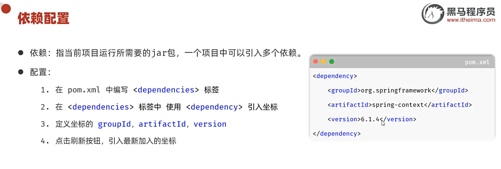
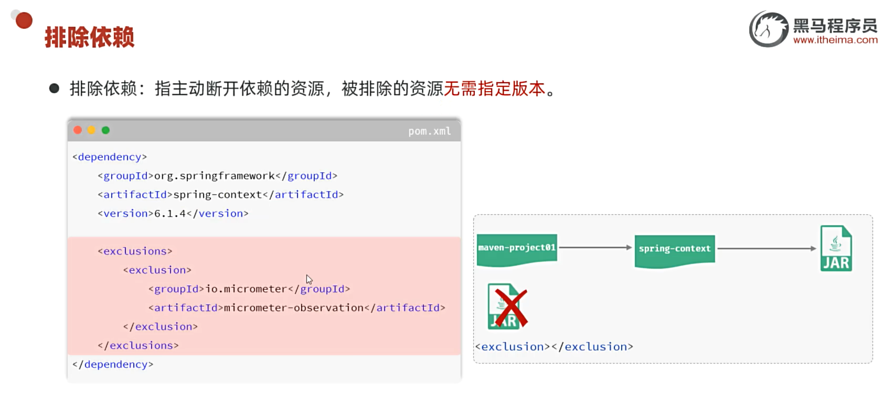
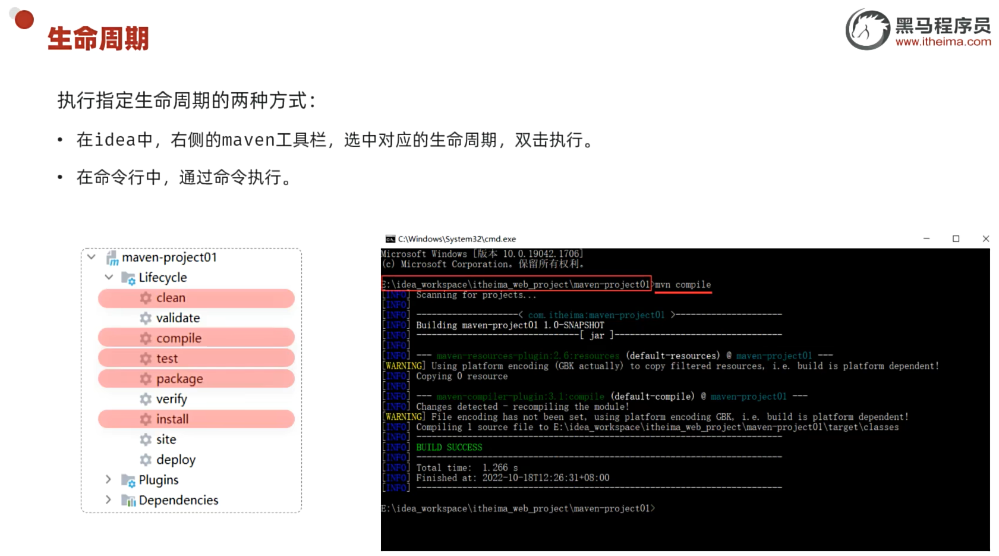
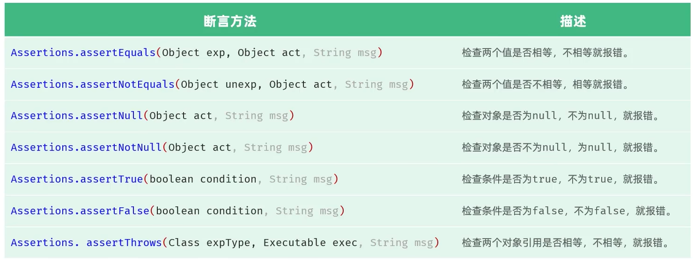

### 管理构建 Java 项目

- 仓库

  项目导入依赖的包源

  - 本地仓库
  - 远程仓库
  - 中央仓库

  先搜索本地仓库, 没有目标资源, 若配置有远程仓库则搜索该仓库, 没有或远程仓库没有则搜索中央仓库, 拿到资源后返回进入上一级仓库, 最后导入项目依赖

- 配置依赖:

  

  Java 包托管仓库:https://mvnrepository.com/

- 依赖传递:

  依赖的依赖会自动同导入的依赖导入项目中

- 排除依赖:

  

- Maven 生命周期

  - clean: 清除遗留文件
    - clean 阶段: 移除上一次构建生成的文件
  - default: 核心工作, 编译, 测试, 打包, 安装, 部署等
    - compile 阶段: 编译项目源码
    - test 阶段: 使用合适的单元测试框架进行测试
    - package 阶段: 编译后的文件打包 jar, war
    - install 阶段: 安装项目到本地仓库
  - site: 生成报告, 发布站点等

  同一套生命周期中(指 clean, default, site), 运行后面的阶段, 前面的阶段都会运行

  

- 测试

  - 单元测试

    对软件的基本组成单位测试

  - 集成测试

    由单元集成子系统进行测试

  - 系统测试

    集成好的软件系统进行测试

  - 验收测试

    针对用户需求, 业务流程进行的测试

  测试方法:

  - 白盒测试

    关注软件的内部结构

  - 黑盒测试

    关注功能以及兼容性

  - 灰盒测试

    两者皆关注

- 单元测试

  JUnit: 单元测试框架:

  - 

  - 命名规范: XxxTest

  - 方法规定:

    ​	public void xxxx(){...}

  断言:

  - 用于测定被测试方法是否按照预期效果工作

    

  常用注解:
  
  - 

 依赖范围:

- 