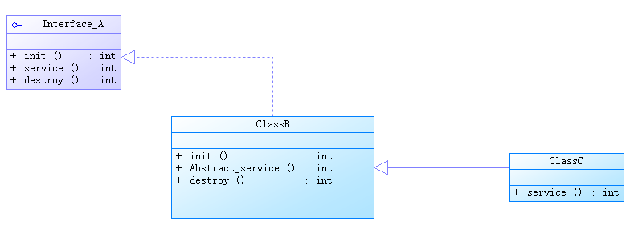

### 适配器设计模式



如下, 创建 GenericServlet 作为适配器, 将需要用到的方法设为抽象方法:

```java
public abstract class GenericServlet implements Servlet {
    @Override
    public void init(ServletConfig servletConfig) throws ServletException {
		//Tomcat自动调用GenericServlet中的init方法
    }

    @Override
    public ServletConfig getServletConfig() {
        return null;
    }

    @Override
    public abstract void service(ServletRequest servletRequest, ServletResponse servletResponse) throws ServletException, IOException ;

    @Override
    public String getServletInfo() {
        return "";
    }

    @Override
    public void destroy() {

    }
}
```

目标类 StudentServlet 继承 GenericServlet,, 重写目标方法:

```java
public class StudentServlet extends GenericServlet {
    @Override
    public void service(ServletRequest servletRequest, ServletResponse servletResponse) throws ServletException, IOException {
        Connection conn = null;
        PreparedStatement ps = null;
        ResultSet rs = null;
        try {
            //设置响应类型
            servletResponse.setContentType("text/html");
            PrintWriter out = servletResponse.getWriter();
            //注册驱动
            Class.forName("com.mysql.cj.jdbc.Driver");
            //获取链接
            String url = "jdbc:mysql://localhost:3306/jdbc";
            String user = "root";
            String password = "1234";
            conn = DriverManager.getConnection(url,user,password);
            //获取预编译数据库操作对象
            String sql = "select name from t_user";
            ps = conn.prepareStatement(sql);
            //执行SQL
            rs = ps.executeQuery();
            //处理结果集
            while (rs.next()) {
                String name = rs.getString("name");
                out.println(name);
            }

        } catch (ClassNotFoundException | SQLException e) {
            throw new RuntimeException(e);
        } finally {
            //释放资源
            if (rs != null) {
                try{rs.close();}catch(SQLException e){e.printStackTrace();}
            }
            if (ps != null) {
                try{ps.close();}catch(SQLException e){e.printStackTrace();}
            }
            if (conn != null) {
                try{conn.close();}catch(SQLException e){e.printStackTrace();}
            }
        }
    }
}

```

实际上, 编写 Servlet 类不需要直接继承 GenericServlet, 作为 B/S 结构的系统, 基于 HTTP 超文本传输协议, 在 Servlet 规范中提供 HttpServlet 类专为 HTTP 协议准备, 只需继承 HttpServlet 即可:

```
jakarta.servlet.Servlet（接口）【爷爷】
jakarta.servlet.GenericServlet implements Servlet（抽象类）【儿子】
jakarta.servlet.http.HttpServlet extends GenericServlet（抽象类）【孙子】
```


### ServletConfig

- 即 Servlet 对象的配置信息对象, 两者一一对应, 都在用户第一次发出请求时创建

- 常用方法

  ```java
  public String getInitParameter(String name); // 通过初始化参数的name获取value
  public Enumeration<String> getInitParameterNames(); // 获取所有的初始化参数的name
  public ServletContext getServletContext(); // 获取ServletContext对象
  public String getServletName(); // 获取Servlet的name
  ```

### ServletContext

- 同一 webapp 下所有 Servlet 对象共享一个 ServletContext 对象, 与 webapp 一一对应

- 在服务器启动时创建, 关闭时销毁, 是应用级对象

- 常用方法:

  ```java
  public String getInitParameter(String name); // 通过初始化参数的name获取value
  public Enumeration<String> getInitParameterNames(); // 获取所有的初始化参数的name
  ```

  ```xml
  <context-param>
      <param-name>pageSize</param-name>
      <param-value>10</param-value>
  </context-param>
  <context-param>
      <param-name>startIndex</param-name>
      <param-value>0</param-value>
  </context-param>
  <!--注意：以上的配置信息属于应用级的配置信息，一般一个项目中共享的配置信息会放到以上的标签当中。-->
  <!--如果你的配置信息只是想给某一个servlet作为参考，那么你配置到servlet标签当中即可，使用ServletConfig对象来获取。-->
  ```

  ```java
  // 用于动态获取应用的根路径
  public String getContextPath();
  //ServletConfig config = getServletConfig();
  //ServletContext application = config.getServletContext(); 通过ServletConfig获取ServletContext对象
  //String contextPath = application.getContextPath();
  ```

  ```java
  // 获取文件的绝对路径（真实路径）
  public String getRealPath(String path);
  ```

  ```java
  // 通过ServletContext对象也是可以记录日志的
  public void log(String message);
  public void log(String message, Throwable t);
  //Throwable是java中所有错误和异常的基类
  // 这些日志信息记录到哪里了？
  // localhost.2021-11-05.log
  
  // Tomcat服务器的logs目录下都有哪些日志文件？
  //catalina.2021-11-05.log 服务器端的java程序运行的控制台信息。
  //localhost.2021-11-05.log ServletContext对象的log方法记录的日志信息存储到这个文件中。
  //localhost_access_log.2021-11-05.txt 访问日志
  ```

  ServletContext 又被称为应用域, 所有用户共享一份数据, 避免线程并发带来的安全问题, 其中存储的数据一般都是只读的, 应用域相当于一个缓存, 获取数据效率较高:

  ```java
  // 存（怎么向ServletContext应用域中存数据）
  public void setAttribute(String name, Object value); // map.put(k, v)
  // 取（怎么从ServletContext应用域中取数据）
  public Object getAttribute(String name); // Object v = map.get(k)
  // 删（怎么删除ServletContext应用域中的数据）
  public void removeAttribute(String name); // map.remove(k)
  ```

  总结:

  - 存储读取应用级配置信息等
  - 动态获取应用的根路径
  - 获取文件绝对路径
  - 记录日志

### 一些缓存机制的总结

- 堆内存中的字符串常量池
- 堆内存中的整数型常量池
- 连接池
- 线程池
- redis
- ServletContext 应用域

### HTTP 协议

- http 协议包括:

  - 请求协议
  - 响应协议

- 请求协议:

  - 包括:

    - 请求行
    - 请求头
    - 空白行
    - 请求体

  - GET 请求

    - 只读, 从服务器获取资源

    - 浏览器自动缓存 GET 请求的响应

    - 所有请求参数都显示在 URL 中

    - 幂等性: 多次相同请求得到相同结果

    - ```text
      https://example.com/products?category=electronics&page=1#recommendations
      └┬──┘  └────┬──────┘ └─┬──┘ └──────────────┬───────────┘ └──────┬───────┘
       │          │          │                   │                    │
      协议        域名       路径                查询字符串              锚点
      
      ```

    - ```text
      请求行
      POST /servlet05/postServlet HTTP/1.1                                               
      请求头
      Host: localhost:8080                                                               
      Connection: keep-alive
      Content-Length: 25
      Cache-Control: max-age=0
      sec-ch-ua: "Google Chrome";v="95", "Chromium";v="95", ";Not A Brand";v="99"
      sec-ch-ua-mobile: ?0
      sec-ch-ua-platform: "Windows"
      Upgrade-Insecure-Requests: 1
      Origin: http://localhost:8080
      Content-Type: application/x-www-form-urlencoded
      User-Agent: Mozilla/5.0 (Windows NT 10.0; Win64; x64) AppleWebKit/537.36 (KHTML, like Gecko) Chrome/95.0.4638.54 Safari/537.36
      Accept: text/html,application/xhtml+xml,application/xml;q=0.9,image/avif,image/webp,image/apng,*/*;q=0.8,application/signed-exchange;v=b3;q=0.9
      Sec-Fetch-Site: same-origin
      Sec-Fetch-Mode: navigate
      Sec-Fetch-User: ?1
      Sec-Fetch-Dest: document
      Referer: http://localhost:8080/servlet05/index.html
      Accept-Encoding: gzip, deflate, br
      Accept-Language: zh-CN,zh;q=0.9
      空白行
           
      请求体
      username=lisi&userpwd=123                                                         
      ```

  - POST 请求

    - 数据位于请求体中

    - 不会被浏览器缓存

    - 在 URL 中不可见

    - 非幂等性

    - ```
      请求行
      POST /servlet05/postServlet HTTP/1.1                                              
      请求头
      Host: localhost:8080                                                               
      Connection: keep-alive
      Content-Length: 25
      Cache-Control: max-age=0
      sec-ch-ua: "Google Chrome";v="95", "Chromium";v="95", ";Not A Brand";v="99"
      sec-ch-ua-mobile: ?0
      sec-ch-ua-platform: "Windows"
      Upgrade-Insecure-Requests: 1
      Origin: http://localhost:8080
      Content-Type: application/x-www-form-urlencoded
      User-Agent: Mozilla/5.0 (Windows NT 10.0; Win64; x64) AppleWebKit/537.36 (KHTML, like Gecko) Chrome/95.0.4638.54 Safari/537.36
      Accept: text/html,application/xhtml+xml,application/xml;q=0.9,image/avif,image/webp,image/apng,*/*;q=0.8,application/signed-exchange;v=b3;q=0.9
      Sec-Fetch-Site: same-origin
      Sec-Fetch-Mode: navigate
      Sec-Fetch-User: ?1
      Sec-Fetch-Dest: document
      Referer: http://localhost:8080/servlet05/index.html
      Accept-Encoding: gzip, deflate, br
      Accept-Language: zh-CN,zh;q=0.9
      空白行
           
      请求体     
      username=lisi&userpwd=123                                                         
      ```

  - 请求行: 请求方式+URL+HTTP 协议版本号

    - 请求方式:
      1. get
      2. post
      3. delete
      4. put
      5. head
      6. options
      7. trace

  - 请求头:

    - 请求的主机
    - 主机端口
    - 浏览器信息
    - 平台信息
    - cookie
    - ...

  - 空白行

    - 区分请求头与请求体

  - 请求体

    - 向服务器发送的具体数据

- 响应协议:

  - 响应协议包括:

    - 状态行
    - 响应头
    - 空白行
    - 响应体

  - 具体报文:

    ```
    状态行
    HTTP/1.1 200 ok
    响应头
    Content-Type: text/html;charset=UTF-8
    Content-Length: 160
    Date: Mon, 08 Nov 2021 13:19:32 GMT
    Keep-Alive: timeout=20
    Connection: keep-alive
    空白行
    
    响应体
    <!doctype html>
    <html>
        <head>
            <title>from get servlet</title>
        </head>
        <body>
            <h1>from get servlet</h1>
        </body>
    </html>
    ```

  - 状态行

    - 协议版本号+状态码+状态描述信息
    - 状态码(HTTP 协议规定的响应状态号)
      - 200: 请求成功
      - 404: 前端错误, 访问资源不存在
      - 405: 前后端请求处理方式不一致
      - 500: 服务端错误
      - 4xx: 一般由浏览器端导致
      - 5xx: 一般由服务端导致
    - 状态描述信息
      - ok
      - not found 资源找不到

  - 响应头

    响应的内容类型, 长度, 时间等

  - 响应体

    响应的正文, 一个很长的字符串, 由服务器渲染, 解释和执行

- 浏览器 network 面板可以查看协议的具体内容

- 目前, post 请求只有含有 method =“post”标签的 form 表单可以发送, 其余情况一律是 get 请求, 如浏览器地址栏直接输入 url, 超链接, method 非 post 属性的表单......

- get 与 post:

  - get 数据挂载在 url 上, post 不可见

  - get 请求只能发送长度有限的普通字符串, post 能发送流媒体等信息, 长度理论无限

  - 对于浏览器, get 适于从服务器请求数据, post 适于向服务器发送数据

  - get 请求支持缓存:

    - 在浏览器缓存中, 一个 get 请求的路径对应一个资源

      浏览器的图片请求:

      ```MERMAID
      graph TD
          A[首次请求图片] --> B{浏览器检查缓存}
          B -->|无缓存| C[发送完整HTTP请求]
          C --> D[服务器返回完整响应]
          D --> E[图片显示 + 缓存存储]
          B -->|有缓存| F{检查缓存是否有效}
          F -->|有效| G[从缓存直接加载]
          F -->|无效| H[发送条件请求]
          H --> I{服务器验证}
          I -->|未修改| J[304 Not Modified]
          J --> G
          I -->|已修改| D
      ```

      如上, 只要发送 get 请求, 浏览器先从缓存中寻找资源

      - 避免走缓存的方法: 浏览器通过 get 请求路径寻找缓存资源, 可通过在 URL 中增加“时间戳”来使每次 get 路径都不同, 从而避免走缓存:

        https://n.sinaimg.cn/finance/590/w240h350/20211101/7cabc342ff5b9dc018b4b00cc.jpg?t = 789789787897898

  - post 请求不支持缓存

  - 无论 get 请求或 post 请求, 发送的请求数据格式都是完全相同的, 无非位置不同

### 模板方法设计模式

- 思想: 在模板类的模板方法中定义核心算法的骨架, 具体实现步骤延迟到子类中完成
- 模板类通常是抽象类, 抽象方法就是不确定实现的方法, 而模板方法通常是 final 修饰的(也可能不是)

### HttpServlet

- 目前接触的 Servlet 规范的接口:

  - Servlet(核心接口)
  - ServletConfig(配置信息接口)

  - ServletContext(上下文接口)
  - ServletRequest(请求接口)
  - ServletResponse(响应接口)

- 目前接触的 Servlet 规范的类:

  - ServletException(异常类)
  - GenericServlet(标准通用 Servlet 抽象类)

- http 包下的类与接口

  - HttpServlet(HTTP 协议专用的 Servlet 抽象类)
  - HttpServletRequest
  - HttpServletResponse

- HttpServletRequest

  - 该对象中由 Tomcat 解析封装了请求协议的全部内容

- HttpServletResponse

  - 用于响应 HTTP 协议到浏览器

- 前后端请求类型不一致: 405 错误, 后端重写 doGet/doPost 方法, 前端必须发送 get/post 请求, 没有重写的方法一定会触发 405

- 一般不需要重写 HttpSerclet 中的 service()方法, 重写后无法享受到 HTTP 协议的专属内容

- Servlet 开发步骤:

  - 编写 Servlet 类继承 HttpServlet
  - 重写 doGet/doPost
  - 配置 Servlet 至 web.xml 文件中
  - 准备前端页面

### 关于一个 web 站点的欢迎页面

- 对于一个 webapp 来说, 若没有指定任何资源而直接访问站点, 显示的页面即为默认的欢迎页面

- 欢迎页面的设置:

  - login.html

  - web.xml 配置:

    ```xml
    <welcome-file-list>
        <!--支持路径-->
            <welcome-file>login.html</welcome-file>
    </welcome-file-list>
    ```

  - 欢迎页面在 CATALINA_HOME/conf/web.xml(全局配置)中有默认配置:

    ```xml
    <welcome-file-list>
        <welcome-file>index.html</welcome-file>
        <welcome-file>index.htm</welcome-file>
        <welcome-file>index.jsp</welcome-file>
    </welcome-file-list>
    ```

    有如上命名可不必在 web.xml 中配置

  - 注意局部优先原则

  - 欢迎页也可以是 Servlet:

    ```xml
        <servlet>
            <servlet-name>HelloServlet</servlet-name>
            <servlet-class>Hello.HelloServlet</servlet-class>
        </servlet>
        <servlet-mapping>
            <servlet-name>HelloServlet</servlet-name>
            <url-pattern>/welcome</url-pattern>
        </servlet-mapping>
        
        <!--login配置-->
        <welcome-file-list>
            <welcome-file>welcome</welcome-file>
        </welcome-file-list>
    ```

### 关于 WEB-INF 目录

- WEB-INF 目录下的资源是受保护的, 不能通过路径直接访问, 因而静态资源放在 WEB-INF 外

### HttpServletRequest

- 父接口: ServletRequest

- 实现类: RequestFacade

- 生命周期: 只在当前请求中有效

- 常用方法:key-value:String-String []

  ```java
  		//获取Map
          Map<String, String[]> parameterMap = req.getParameterMap();
          //获取key
          Enumeration<String> names = req.getParameterNames();
          //获取name的value[]
          String[] values = req.getParameterValues("name");
          //获取value[]的第一个元素
          String value = req.getParameter("name");
  ```

- 前端提交的永远是字符串, 同样, 后端获取到的也永远是字符串

- Request 对象被称为: 请求域

  - 请求域中同样有这三种方法:

    ```java
    void setAttribute(String name, Object obj); // 向域当中绑定数据。
    Object getAttribute(String name); // 从域当中根据name获取数据。
    void removeAttribute(String name); // 将域当中绑定的数据移除
    ```

  - 请求域和应用域尽量使用小的域对象, 减小占用资源

- 跳转: 实现资源切换:

  ```java
  // 第一步：获取请求转发器对象
  // /b为目标资源路径
  RequestDispatcher dispatcher = request.getRequestDispatcher("/b");
  // 第二步：调用转发器的forward方法完成跳转/转发
  // 即将获取到的数据转发给另一个Servlet
  dispatcher.forward(request,response);
  
  // 第一步和第二步代码可以联合在一起。
  request.getRequestDispatcher("/b").forward(request,response);
  
  ```

- 两个 Servlet 共享数据的实现:

  - 将数据放入 Request 域中, 然后转发
  - 转发的下一个资源只要是一个合法资源皆可
  - 转发路径以“/”起始, 不能加项目名

- 方法区分:

  ```java
  
  // uri?username=zhangsan&userpwd=123&sex=1
  String username = request.getParameter("username");
  
  // 之前一定是执行过：request.setAttribute("name", new Object())
  Object obj = request.getAttribute("name");
  
  // 以上两个方法的区别是什么？
  // 第一个方法：获取的是用户在浏览器上提交的数据。
  // 第二个方法：获取的是请求域当中绑定的数据。
  ```

- 其他常用方法:

  ```java
  // 获取客户端的IP地址
  String remoteAddr = request.getRemoteAddr();
  
  // get请求在请求行上提交数据。
  // post请求在请求体中提交数据。
  // 设置请求体的字符集。（显然这个方法是处理POST请求的乱码问题。这种方式并不能解决get请求的乱码问题。）
  // Tomcat10之后，request请求体当中的字符集默认就是UTF-8，不需要设置字符集，不会出现乱码问题。
  // Tomcat9前（包括9在内），如果前端请求体提交的是中文，后端获取之后出现乱码，怎么解决这个乱码？执行以下代码。
  request.setCharacterEncoding("UTF-8");
  
  // 在Tomcat9之前（包括9），响应中文也是有乱码的，怎么解决这个响应的乱码？
  response.setContentType("text/html;charset=UTF-8");
  // 在Tomcat10之后，包括10在内，响应中文的时候就不在出现乱码问题了。以上代码就不需要设置UTF-8了。
  
  // 注意一个细节
  // 在Tomcat10包括10在内之后的版本，中文将不再出现乱码。（这也体现了中文地位的提升。）
  
  // get请求乱码问题怎么解决？
  // get请求发送的时候，数据是在请求行上提交的，不是在请求体当中提交的。
  // get请求乱码怎么解决
  // 方案：修改CATALINA_HOME/conf/server.xml配置文件
  <Connector URIEncoding="UTF-8" />
  // 注意：从Tomcat8之后，URIEncoding的默认值就是UTF-8，所以GET请求也没有乱码问题了。
      
  // 获取应用的根路径
  String contextPath = request.getContextPath();
  
  // 获取请求方式
  String method = request.getMethod();
  
  // 获取请求的URI
  String uri = request.getRequestURI();  // /aaa/testRequest
  
  // 获取servlet path
  String servletPath = request.getServletPath(); //   /testRequest
  
  ```

  