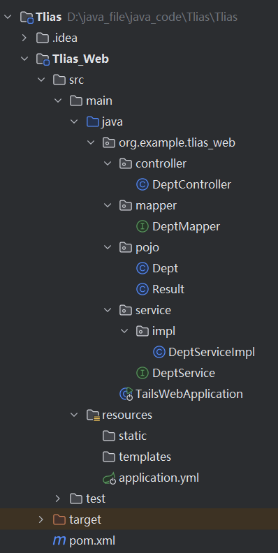
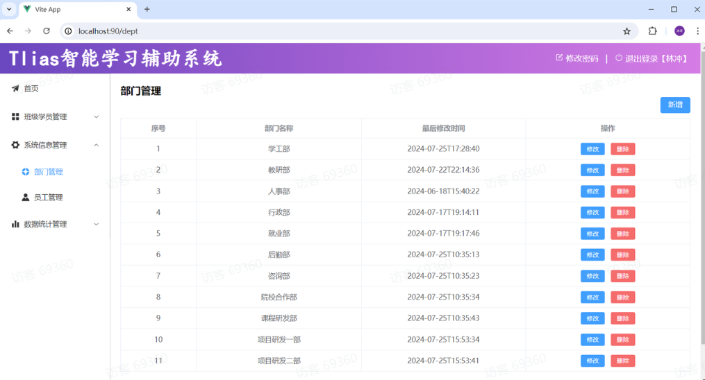
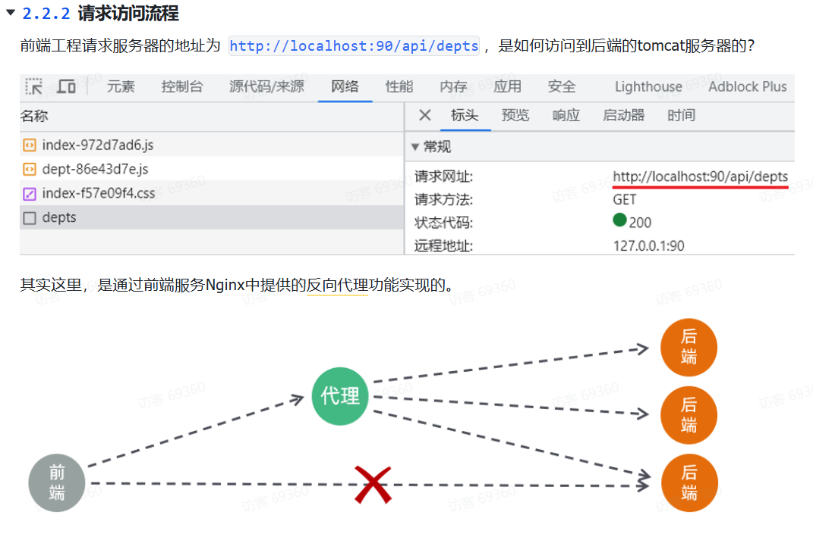
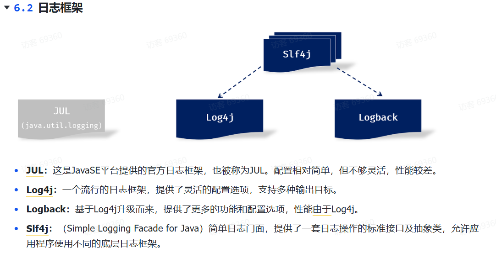
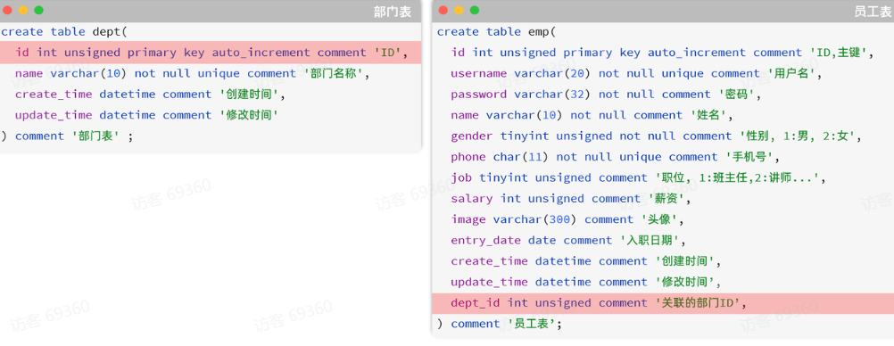
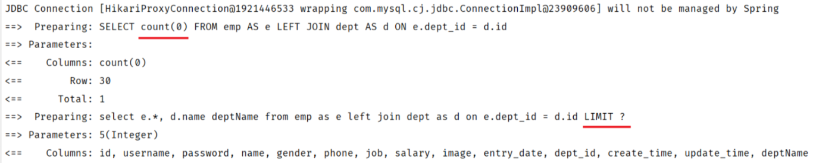

### Tlias 的部门管理模块的知识点总结

- 注解部分

  - DeptController

    - @RequestMapping

      注解在类上(元注解), 用于标识该类的所有方法的请求路径的公共前置路径

      ```java
      @RequestMapping("/depts")
      ```

    - @RestController

      元注解, 相当于@Controller + @ResponseBody:

      ​	将控制层的该类交由 IOC 管理

      ​	将方法返回值直接作为响应值响应给前端, 对象或集合则会先转换为 json 格式

      ```java
      @RestController
      ```

    - @Autowired

      注解在属性上(属性注解), 用于实现依赖注入 DI

      ```java
      @Autowired
      private DeptService deptService;
      ```
    
    - @GetMapping
    
      @PostMapping
    
      @DeleteMapping
    
      @PutMapping
    
      注解在方法上, 标识方法处理的请求方式
    
      ​	REST 风格:
    
      ​		通过 URL 定位需要操作的资源, 通过 HTTP 动词(请求方式)描述具体的操作
    
      ```java
      @GetMapping
      
      @PostMapping
      
      @DeleteMapping
      
      @PutMapping
      ```
    
    - @RequestBody
    
      注解在方法的形参前(参数注解), 用于处理 Json 形式的请求参数, 方法的形参对象的属性名需与请求参数的键值相同
    
      ```java
      public Result save(@RequestBody Dept dept) {
      
              deptService.save(dept);
              return Result.success();
          }
      ```
    
    - @PathVariable
    
      参数注解, 用于获取路径中的参数
    
      ```java
      @GetMapping("/{id}")
          public Result findById(@PathVariable Integer id) {
              Dept dept = deptService.findById(id);
              return Result.success(dept);
          }
      ```
    
  - DeptServiceImpl

    - @Service

      元注解, 标识为业务逻辑层组件, 交由 IOC 管理

      ```java
      @Service
      ```

  - DeptMapper

    - @Mapper

      MyBatis 映射器, 由 mybatis 自动创建 bean 实例, 封装对象, 返回结果

      ```java
      @Mapper
      ```

    - @Select

      @Delete

      @Insert

      @Update

      注解在方法上, 用于指定 sql 语句

      ```java
      @Select("select * from dept")
      ```

      

- 参数传递

  - 请求路径中的参数: 见 Fence 6

  - sql 语句中的参数:

    ```java
    @Insert("insert into dept(name,create_time,update_time) values(#{name},#{createTime},#{updateTime})")
    public void save(Dept dept);
    ```

- 项目结构:

  - 
  
- 前后端联调:

  - 
  - 
  - 
  - 


### 日志技术

- 

- 在 springboot 中已传递了 Logback 依赖

- 引入配置文件:

  ```xml
  <!-- src/main/resources/logback.xml -->
  <!-- 标准的xml声明 --!>
  <?xml version="1.0" encoding="UTF-8"?>
  <configuration>
      <!-- 控制台输出:ConsoleAppender -->
      <appender name="STDOUT" class="ch.qos.logback.core.ConsoleAppender">
          <!-- PatternLayoutEncoder:将一条日志事件按照指定格式转为文本,并将其编码成字节流 -->
          <encoder class="ch.qos.logback.classic.encoder.PatternLayoutEncoder">
              <!--格式化输出：%d表示日期，%thread表示线程名，%-5level：级别从左显示5个字符宽度  %msg：日志消息，%n是换行符 -->
              <pattern>%d{yyyy-MM-dd HH:mm:ss.SSS} [%thread] %-5level %logger{50}-%msg%n</pattern>
          </encoder>
      </appender>
  
      <!-- 日志输出级别 -->
      <root level="ALL">
          <appender-ref ref="STDOUT" />
      </root>
  </configuration>
  ```

  - <configuration>

    Logback 配置文件的根元素

  - <appender>

    附加器, 即日志输出目的地

    - name = "STDOUT"

      指定唯一名称, 约定俗成“STDOUT”, 表示标准输出/控制台

    - class = "ch.qos.logback.core.ConsoleAppender"

      指定该附加器的实现类

  - <encoder>

    编码器, 将日志事件转换为字节流, 并按指定格式输出

  - <pattern>

    一条日志信息的最终输出格式

  - <root>

    配置根 Logger, 用于指定那些日志会被记录

    级别: TRACE, DEBUG, INFO, WARN, ERROR

    

    All 表示所有级别的日志都会被记录

    大于等于配置的日志级别的日志才会输出

  - <appender-ref ref="STDOUT" />

    将已定义好的附加器附加到当前的 logger 上

- 输出日志至文件的附加器

  ```xml
  <!-- 按照每天生成日志文件 -->
  <appender name="FILE" class="ch.qos.logback.core.rolling.RollingFileAppender">
      <rollingPolicy class="ch.qos.logback.core.rolling.SizeAndTimeBasedRollingPolicy">
          <!-- 日志文件输出的文件名, %i表示序号 -->
          <FileNamePattern>D:/tlias-%d{yyyy-MM-dd}-%i.log</FileNamePattern>
          <!-- 最多保留的历史日志文件数量 -->
          <MaxHistory>30</MaxHistory>
          <!-- 最大文件大小，超过这个大小会触发滚动到新文件，默认为 10MB -->
          <maxFileSize>10MB</maxFileSize>
      </rollingPolicy>
  
      <encoder class="ch.qos.logback.classic.encoder.PatternLayoutEncoder">
          <!--格式化输出：%d 表示日期，%thread 表示线程名，%-5level表示级别从左显示5个字符宽度，%msg表示日志消息，%n表示换行符 -->
          <pattern>%d{yyyy-MM-dd HH:mm:ss.SSS} [%thread] %-5level %logger{50}-%msg%n</pattern>
      </encoder>
  </appender>
  ```

- 案例:

  ```java
  /**
   * 部门管理控制器
   */
  @Slf4j
  @RequestMapping("/depts")
  @RestController
  public class DeptController {
  
      @Autowired
      private DeptService deptService;
  
      /**
       * 查询部门列表
       */
      //@RequestMapping(value = "/depts", method = RequestMethod.GET)
      @GetMapping
      public Result list(){
          //System.out.println("查询部门列表");
          log.info("查询部门列表");
          List<Dept> deptList = deptService.findAll();
          return Result.success(deptList);
      }
  
      /**
       * 根据id删除部门 - delete http://localhost:8080/depts?id=1
       */
      @DeleteMapping
      public Result delete(Integer id){
          //System.out.println("根据id删除部门, id=" + id);
          log.info("根据id删除部门, id: {}" , id);
          deptService.deleteById(id);
          return Result.success();
      }
  
      /**
       * 新增部门 - POST http://localhost:8080/depts   请求参数：{"name":"研发部"}
       */
      @PostMapping
      public Result save(@RequestBody Dept dept){
          //System.out.println("新增部门, dept=" + dept);
          log.info("新增部门, dept: {}" , dept);
          deptService.save(dept);
          return Result.success();
      }
  
      /**
       * 根据ID查询 - GET http://localhost:8080/depts/1
       */
      @GetMapping("/{id}")
      public Result getById(@PathVariable Integer id){
          //System.out.println("根据ID查询, id=" + id);
          log.info("根据ID查询, id: {}" , id);
          Dept dept = deptService.getById(id);
          return Result.success(dept);
      }
  
      /**
       * 修改部门 - PUT http://localhost:8080/depts  请求参数：{"id":1,"name":"研发部"}
       */
      @PutMapping
      public Result update(@RequestBody Dept dept){
          //System.out.println("修改部门, dept=" + dept);
          log.info("修改部门, dept: {}" , dept);
          deptService.update(dept);
          return Result.success();
      }
  }
  ```

  - @Slf4j

    元注解, 由 lombok 提供, 简化了定义日志记录器:

    ```java
    //使用本类的全限定类名来作为该日志记录器的名字
    //该名字创建了一个层级结构,类似于Java的包,允许在配置文件中为应用程序的不同模块设置不同的日志级别和输出目的地
    private static Logger log = LoggerFactory.getLogger(Xxx. class);
    ```

  - ```java
    //类比System.out.println("根据id删除部门, id=" + id);
    log.info("根据id删除部门, id: {}" , id);
    ```

### SQL 多表查询

- 多表关系

  ​	一对多

  - 即部门与员工的关系（一个部门下有多个员工）

    

    对于该情况, 需要为员工表添加外键约束, 以将两表联系起来:

    ```mysql
    -- 创建表时指定
    create table 表名(
            字段名    数据类型,
            ...
            [constraint]   [外键名称]  foreign  key (外键字段名)   references   主表 (主表列名)        
    );
    
    
    -- 建完表后，添加外键
    alter table  表名  add constraint  外键名称  foreign key(外键字段名) references 主表(主表列名);
    ```

  - 物理外键与逻辑外键

    物理外键:

    - 使用 foreign key 定义外键关联另一张表
    - 仅用于单节点数据库, 不适于分布式, 集群场景
    - 容易引发数据库的死锁问题, 消耗性能

    逻辑外键

    - 在业务层逻辑中, 解决外键关联

    [^注]:在现在的企业开发中，很少会使用物理外键，都是使用逻辑外键。 甚至在一些数据库开发规范中，会明确指出禁止使用物理外键 foreign key

  一对一:

  - 

  多对多:

  - 

- 多表查询

  连接查询

  - 内连接: A 与 B 的交集

    - 隐式内连接:

      ```sql
      select  字段列表   from   表1 , 表2   where  条件 ... ;
      ```

    - 显示内连接:

      ```sql
      select  字段列表   from   表1  [ inner ]  join 表2  on  连接条件 ... ;
      ```

      

  - 外连接:

    - 左外连接: 查 A

      ```sql
      select  字段列表   from   表1  left  [ outer ]  join 表2  on  连接条件 ... ;
      ```

      

    - 右外连接: 查 B

      ```sql
      select  字段列表   from   表1  right  [ outer ]  join 表2  on  连接条件 ... ;
      ```

      

  子查询

  - SQL 语句嵌套 select 语句

    - 标量子查询:

      子查询返回结果为单个值

    - 列子查询

    - 行子查询

    - 表子查询

- 分页查询

  - limit 关键字:

    - ```sql
      limit  开始索引  每页显示的条数
      ```

  - 基于页面原型:

    - 前端请求参数:

      page: 当前页码

      pageSize: 每页显示条数

    - 后端响应数据:

      查询到的数据列表(封装在 list 集合中)

      总记录数

  - PageHelper 分页插件
  
    - PageHelper 是第三方提供的 Mybatis 框架中的一款功能强大、方便易用的分页插件，支持任何形式的单表、多表的分页查询。
  
    - 实例:
  
      ```java
      //Mapper
      
      @Select("select e.*, d.name deptName from emp as e left join dept as d on e.dept_id = d.id")
      public List<Emp> list();
      ```
  
      ```java
      //Service
      
      @Override
          public PageResult page(Integer page, Integer pageSize) {
              //1. 设置分页参数
              PageHelper.startPage(page,pageSize);
      
              //2. 执行查询(Page继承了ArrayList,是List的实现类)
              List<Emp> empList = empMapper.list();
              Page<Emp> p = (Page<Emp>) empList;
      
              //3. 封装结果
              return new PageResult(p.getTotal(), p.getResult());
          }
      ```
  
    - 该机制下本质上执行了两条 sql 语句:
      
  
    - 第一条通过将最终表替换 count(0)来统计结果数
  
      第二条在最终表后(逻辑为在语句尾部)添加 limit ?,?来输出分页查询结果, 因此不能添加分号
  
      最终结果封装至 Page <Emp> 对象中
  
    - 注意: PageHelper 实现分页查询时，SQL 语句的结尾一定一定一定不要加分号
  
      ​	  PageHelper 只会对紧跟在其后的第一条 SQL 语句进行分页处理

### 条件分页查询模块实现

- Controller层

  ```java
  @Slf4j
  @RequestMapping("/emps")
  @RestController
  public class EmpController {
  
      @Autowired
      private EmpService empService;
  
      @GetMapping
      public Result page(EmpQueryParam empQueryParam){
          log.info("查询请求参数： {}", empQueryParam);
          PageResult pageResult = empService.page(empQueryParam);
          return Result.success(pageResult);
      }
  }
  //EmpQueryParam封装请求数据
  ```

- 	Service层

  ```java
  @Service
  public class EmpServiceImpl implements EmpService {
  
      @Autowired
      private EmpMapper empMapper;
  
      @Override
      public PageResult page(EmpQueryParam empQueryParam) {
          //1. 设置分页参数
          PageHelper.startPage(empQueryParam.getPage(), empQueryParam.getPageSize());
  
          //2. 执行查询
          List<Emp> empList = empMapper.list(empQueryParam);
  
          //3. 封装结果
          Page<Emp> p = (Page<Emp>)empList;
          return new PageResult(p.getTotal(), p.getResult());
      }
  }
  ```
  
- Repository层

  ```java
  /**
       * 当方法有多个参数时
       * MyBatis默认会将这些参数封装为一个 Map
       * 其中键的名称为 arg0、arg1 或 param1、param2，而不是方法参数的实际名称
       * 如果 SQL 中的占位符（如 #{start}）与默认的参数名称不匹配，就会报错
       * 可通过添加参数注解 @Param("start") 解决
       */
  public List<Emp> list(EmpQueryParam empQueryParam);
  ```

- EmpMapper.xml

  ```xml
  <!--定义Mapper映射文件的约束和基本结构,该文件路径:"\src\main\resources\org\example\tlias_web\mapper\EmpMapper.xml"
  resources后的路径必须与EmpMapper.class文件一致-->
  <!DOCTYPE mapper
          PUBLIC "-//mybatis.org//DTD Mapper 3.0//EN"
          "http://mybatis.org/dtd/mybatis-3-mapper.dtd">
  <mapper namespace="org.example.tlias_web.mapper.EmpMapper">
      <select id="list" resultType="org.example.tlias_web.pojo.Emp">
          select e.*, d.name deptName from emp as e left join dept as d on e.dept_id = d.id
          <where>
              <if test="name != null and name != ''">
                  e.name like concat('%',#{name},'%')
              </if>
              <if test="gender != null">
                  and e.gender = #{gender}
              </if>
              <if test="begin != null and end != null">
                  and e.entry_date between #{begin} and #{end}
              </if>
          </where>
      </select>
  </mapper>
  
  <!-- Mybatis中的动态SQL:随着用户的输入或外部的条件的变化而变化的SQL语句
   <if>：判断条件是否成立，如果条件为true，则拼接SQL。
  <where>：根据查询条件，来生成where关键字，并会自动去除条件前面多余的and或or。-->
  ```

- application.yml

  ```xml
  spring:
    application:
      name: Alias_Web
  
    datasource:
      # type: com.alibaba.druid.pool.DruidDataSource
      url: jdbc:mysql://localhost:3306/test01
      driver-class-name: com.mysql.cj.jdbc.Driver
      username: root
      password: 1234
  
  mybatis:
    configuration:
      #输出日志至控制台
      log-impl: org.apache.ibatis.logging.stdout.StdOutImpl
      #开启驼峰命名法
      map-underscore-to-camel-case: true
  
  #reasonable：分页合理化参数，默认值为false。当该参数设置为true时，pageNum<=0时会查询第一页，pageNum>pages（超过总数时），会查询最后一页。默认false 时，直接根据参数进行查询。 
  pagehelper:
    reasonable: true
    helper-dialect: mysql
  ```
  
  
