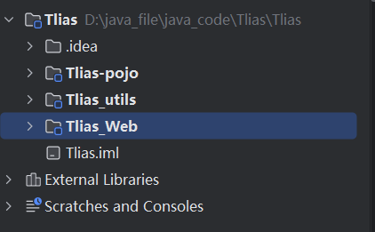

​	## 分模块设计与开发



如上图,在核心模块中引入其他需要使用的模块的依赖:

```xml
        <dependency>
            <groupId>org.example</groupId>
            <artifactId>Tlias-pojo</artifactId>
            <version>1.0-SNAPSHOT</version>
        </dependency>

        <dependency>
            <groupId>org.example</groupId>
            <artifactId>Tlias_utils</artifactId>
            <version>1.0-SNAPSHOT</version>
        </dependency>
```

### 继承与聚合

#### 继承

子工程可以继承父工程,类似于java中的继承机制,可通过该功能实现依赖共享,不必在子工程的配置文件中重复引入

##### 打包方式

```xml
<packaging>pom</packaging>
<!-- 默认为jar方式,这里需要设置为pom -->
<!-- 
Java中打包方式：
1.jar包：普通模块打包，spring boot项目基本上都是jar包（内嵌tomcat运行）。
2.war包：普通的web程序打包，需要部署在外部的tomcat服务器中运行。
3.pom包：父工程或者聚合工程，该模块不写代码，仅进行依赖管理。
-->
```

##### 实现

```xml
<?xml version="1.0" encoding="UTF-8"?>
<project xmlns="http://maven.apache.org/POM/4.0.0"
         xmlns:xsi="http://www.w3.org/2001/XMLSchema-instance"
         xsi:schemaLocation="http://maven.apache.org/POM/4.0.0 http://maven.apache.org/xsd/maven-4.0.0.xsd">
    <modelVersion>4.0.0</modelVersion>

    <parent>
        <groupId>org.springframework.boot</groupId>
        <artifactId>spring-boot-starter-parent</artifactId>
        <version>3.2.8</version>
        <relativePath/> <!-- 继承文件的路径 -->
<!-- 
<relativePath>父工程pom.xml文件的相对路径(整个project)</relativePath>
用于指定父工程中pom的位置,若不指定,将从仓库中查找该工程
-->
    </parent>

    <groupId>com.itheima</groupId>
    <artifactId>tlias-parent</artifactId>
    <version>1.0-SNAPSHOT</version>
    <packaging>pom</packaging> <!-- 设置打包方式 -->

    <properties>
        <maven.compiler.source>17</maven.compiler.source>
        <maven.compiler.target>17</maven.compiler.target>
        <project.build.sourceEncoding>UTF-8</project.build.sourceEncoding>
    </properties>
	
    <dependencies> <!-- 配置父依赖,即子工程中共有依赖 -->
        <dependency>
            <groupId>org.springframework.boot</groupId>
            <artifactId>spring-boot-starter</artifactId>
            <version>3.2.8</version>
        </dependency>

        <dependency>
            <groupId>org.projectlombok</groupId>
            <artifactId>lombok</artifactId>
            <version>1.18.34</version>
        </dependency>
    </dependencies>
    
</project>
```

子工程配置文件:

```xml
<parent>
    <groupId>com.itheima</groupId> <!-- - 在子工程中，配置了继承关系之后，坐标中的groupId是可以省略的，因为会自动继承父工程的 -->
    <artifactId>tlias-parent</artifactId>
    <version>1.0-SNAPSHOT</version>
    <relativePath>../tlias-parent/pom.xml</relativePath>
</parent>	
```

##### 版本锁定

在父工程的pom文件中可通过<dependencyManagement>标签统一管理依赖版本

```xml
<!--统一管理依赖版本-->
<dependencyManagement>
<!--
该标签中只能统一管理依赖版本
不能直接将依赖引入
使用后,子工程的pom文件中引入对应依赖时不需要再指定版本,只需在父工程中统一变更
-->
    <dependencies>
        <!--JWT令牌-->
        <dependency>
            <groupId>io.jsonwebtoken</groupId>
            <artifactId>jjwt</artifactId>
            <version>0.9.1</version> <!-- 统一指定的版本 -->
        </dependency>
    </dependencies>
</dependencyManagement>
```

###### 属性配置

```xml
<?xml version="1.0" encoding="UTF-8"?>
<project xmlns="http://maven.apache.org/POM/4.0.0"
         xmlns:xsi="http://www.w3.org/2001/XMLSchema-instance"
         xsi:schemaLocation="http://maven.apache.org/POM/4.0.0 http://maven.apache.org/xsd/maven-4.0.0.xsd">
    <modelVersion>4.0.0</modelVersion>

    <parent>
        <groupId>org.springframework.boot</groupId>
        <artifactId>spring-boot-starter-parent</artifactId>
        <version>3.2.8</version>
        <relativePath/> <!-- lookup parent from repository -->
    </parent>

    <groupId>com.itheima</groupId>
    <artifactId>tlias-parent</artifactId>
    <version>1.0-SNAPSHOT</version>
    <packaging>pom</packaging>

    <properties> <!-- 用于集中管理项目的配置属性 -->
        <maven.compiler.source>17</maven.compiler.source>
        <maven.compiler.target>17</maven.compiler.target>
        <project.build.sourceEncoding>UTF-8</project.build.sourceEncoding>

        <spring-boot.version>3.2.8</spring-boot.version>
        <lombok.version>1.18.34</lombok.version>
        <jwt.version>0.9.1</jwt.version>
        <aliyun.oss.version>3.17.4</aliyun.oss.version>
        <jaxb.version>2.3.1</jaxb.version>
        <javax.activation.version>1.1.1</javax.activation.version>
        <jaxb.runtime.version>2.3.3</jaxb.runtime.version>
    </properties>

    <dependencies>
        <dependency>
            <groupId>org.springframework.boot</groupId>
            <artifactId>spring-boot-starter</artifactId>
            <version>${spring-boot.version}</version> <!-- 自定义属性 -->
        </dependency>

        <dependency>
            <groupId>org.projectlombok</groupId>
            <artifactId>lombok</artifactId>
            <version>${lombok.version}</version>
        </dependency>
    </dependencies>

    <dependencyManagement>
        <dependencies>
            <!-- JWT依赖-->
            <dependency>
                <groupId>io.jsonwebtoken</groupId>
                <artifactId>jjwt</artifactId>
                <version>${jwt.version}</version>
            </dependency>

            <dependency>
                <groupId>com.aliyun.oss</groupId>
                <artifactId>aliyun-sdk-oss</artifactId>
                <version>${aliyun.oss.version}</version>
            </dependency>
            <dependency>
                <groupId>javax.xml.bind</groupId>
                <artifactId>jaxb-api</artifactId>
                <version>${jaxb.version}</version>
            </dependency>
            <dependency>
                <groupId>javax.activation</groupId>
                <artifactId>activation</artifactId>
                <version>${javax.activation.version}</version>
            </dependency>
            <!-- no more than 2.3.3-->
            <dependency>
                <groupId>org.glassfish.jaxb</groupId>
                <artifactId>jaxb-runtime</artifactId>
                <version>${jaxb.runtime.version}</version>
            </dependency>
        </dependencies>
    </dependencyManagement>

</project>
```

###### **`<dependencyManagement>`** **与** **`<dependencies>`** **的区别是什么?**

- `<dependencies>` 是直接依赖，在父工程配置了依赖，子工程会直接继承下来。 
- `<dependencyManagement>` 是统一管理依赖版本，不会直接依赖，还需要在子工程中引入所需依赖(无需指定版本)

#### 聚合

由于tlias-web模块依赖了tlias-pojo与tlias-utils模块,又继承于tlias-parent,在进行项目打包时,maven会自动从**本地仓库**查找父工程tlias-parent,以及其依赖tlias-pojo与tlias-utils

- 聚合:将多个模块统一为一个整体,同时进行项目的构建
- 聚合工程:一个不具有业务功能的空工程,即只有一个pom文件,一般来换,**聚合工程与父工程是同一个**
- 作用:快速构建项目

```xml
<!-- 聚合其他模块 -->
<!--
指定当前聚合工程所包含的子模块
此后编译,打包,安装等操作无需在每个模块中单独操作,只需要在聚合工程中进行即可
-->
<modules>
    <module>../tlias-pojo</module>
    <module>../tlias-utils</module>
    <module>../tlias-web-management</module>
</modules>
```

### 私服

用于解决多个项目组进行开发时的资源共享问题

#### 资源的上传与下载

##### 配置

- 设置私服的访问用户名与密码

  ```xml
  <!--
  在maven的安装目录下:conf/settings.xml中设置:
  -->
  <server>
      <id>maven-releases</id>
      <username>admin</username>
      <password>admin</password>
  </server>
      
  <server>
      <id>maven-snapshots</id>
      <username>admin</username>
      <password>admin</password>
  </server>
  <!--
  设置私服依赖下载的仓库组地址
  在mirror中配置/在profile中配置
  -->
  <mirror>
      <id>maven-public</id>
      <mirrorOf>*</mirrorOf>
      <url>http://localhost:8081/repository/maven-public/</url>
  </mirror>
  <!--
  若不添加profile,则只允许使用release仓库中的依赖
  而不允许使用snapshot仓库中的依赖
  -->
  <profile>
      <id>allow-snapshots</id>
      <activation>
          <activeByDefault>true</activeByDefault>
      </activation>
      <repositories>
          <repository>
              <id>maven-public</id>
              <url>http://localhost:8081/repository/maven-public/</url>
              <releases>
                  <enabled>true</enabled>
              </releases>
              <snapshots>
                  <enabled>true</enabled>
              </snapshots>
          </repository>
      </repositories>
  </profile>
  ```

  ```xml
  <!--
  maven工程的pom文件中配置上传地址
  直接在父工程中配置
  -->
  <distributionManagement>
      <!-- release版本的发布地址 -->
      <repository>
          <id>maven-releases</id>
          <url>http://localhost:8081/repository/maven-releases/</url>
      </repository>
      <!-- snapshot版本的发布地址 -->
      <snapshotRepository>
          <id>maven-snapshots</id>
          <url>http://localhost:8081/repository/maven-snapshots/</url>
      </snapshotRepository>
  </distributionManagement>
  ```

  

##### 上传

通过**deploy**生命周期,将项目打包后发布到私服仓库中
