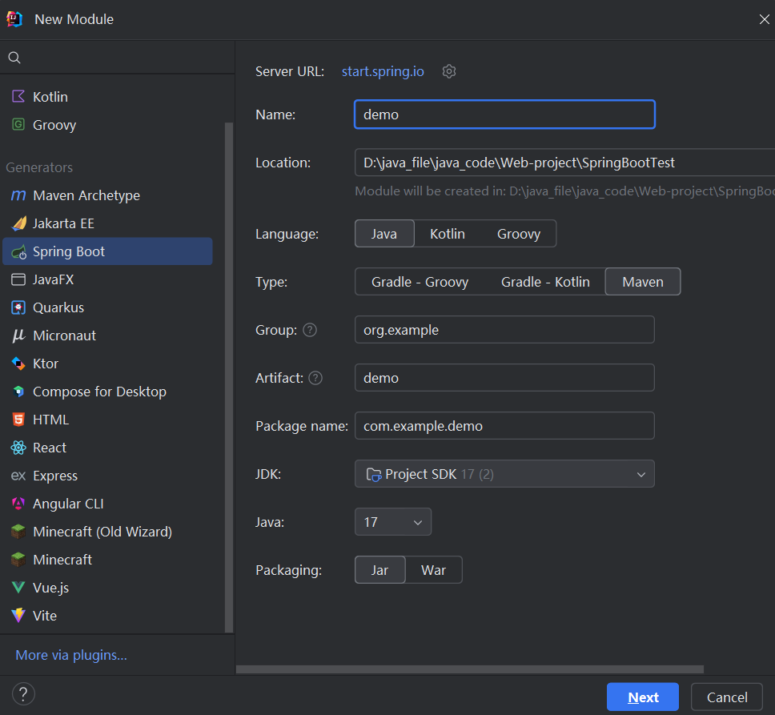
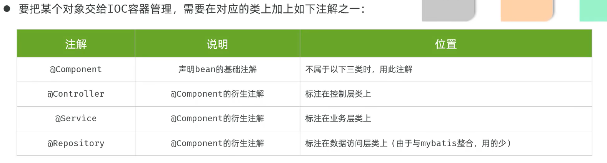
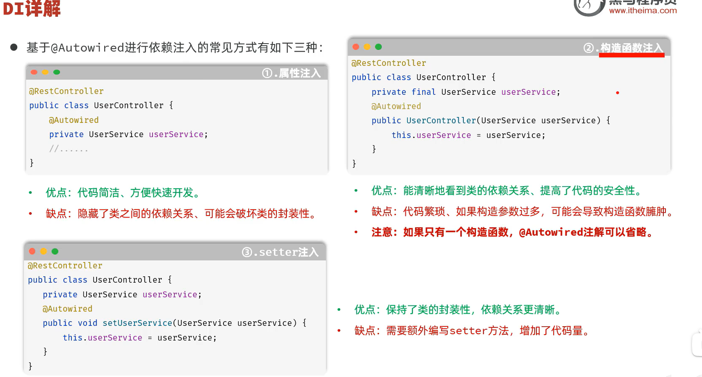

### 服务器端搭建




### 项目结构基础

- 起步依赖

  - ```xml
        <dependencies>
            <dependency>
                <groupId>org.springframework.boot</groupId>
                <artifactId>spring-boot-starter-web</artifactId>
            </dependency>
    
            <dependency>
                <groupId>org.springframework.boot</groupId>
                <artifactId>spring-boot-starter-test</artifactId>
                <scope>test</scope>
            </dependency>
    </dependencies>
    ```

  - spring-boot-starter-web:包含web开发所需要的常见依赖

  - spring-boot-starter-test:单元测试所需要的常见依赖

- ```Java
  @RestController
  //它其实是一个组合注解，相当于 @Controller + @ResponseBody 的合体。
  
  //@Controller：表明这个类是一个控制器，可以接收和处理Web请求。
  //@ResponseBody：告诉Spring，这个控制器下所有方法的返回值都应该被直接序列化成HTTP响应体的内容（通常是JSON或XML格式），而不是去查找并渲染一个模板视图
  ```

- ```java
  @RequestMapping
  //建立Web请求与处理方法之间的映射关系
  
  //用在类上：定义一个基础的、通用的URL前缀。
  //用在方法上：定义该方法具体的URL路径和请求规则。
  ```

  

### 分层解耦

三层架构:

- controller

  控制层:接收请求,处理请求,响应数据

- service

  业务逻辑层:具体业务逻辑

- dao

  数据访问层(持久层):crud

分层解耦:

- 控制反转(IOC)

  对象的创建控制权由程序自身转移到外部容器

- 依赖注入(DI)

  容器为应用程序提供运行时,所依赖的资源

- Bean对象

  在IOC容器中创建,管理的对象

实例:

- ```java
  @Component //将当前类产生的对象交由IOC管理
  ```

- ```java
  @Autowired //程序运行时,自动查询该属性类型的bean对象,并赋值给该成员变量
  ```

详解:

- 

- 这些注解要先生效,还需要被@ComponentScan扫描,默认自动扫描启动类所在地包及其子包(启动类中的(@SpringBootApplication)
- 

- 