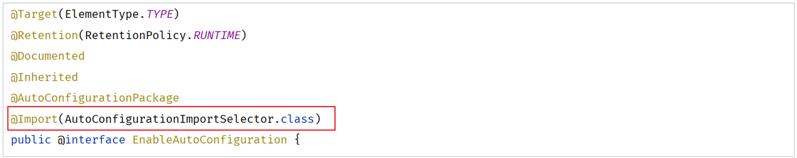
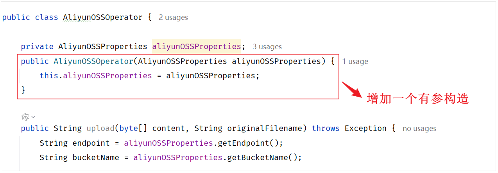

## SpringBoot 原理

### 配置优先级

配置文件:

- properties
- yml
- yaml

properties > yml > yaml

外部属性配置:


- Java 系统属性配置:

  ```yaml
  # 格式:-Dkey=value
  -Dserver.port=9000
  ```

- 命令行参数:

  ```yaml
  # 格式:--key=value
  --server.port=10010
  ```

命令行参数 > Java 系统属性参数 > 配置文件

打包后设置 Java 系统属性参数和命令行参数:

```yaml
java -Dserver.port=9000 -jar XXXXX.jar --server.port=10010
```

在打包程序运行时指定 Java 系统属性参数和命令行参数:

- 执行 maven 打包指令 package 将项目打包为 jar 文件(打包插件: spring-boot-maven-plugin)

- 运行 jar 文件程序:

  ```yaml
  java -jar
  # 同时设置Java系统属性参数和命令行参数
  java -Dserver.port=9000 -jar xxx.jar --server.port=10010
  ```

### Bean 的管理

#### Bean 的作用域

- singleton(默认)

  容器内同名称的 bean 只有一个实例,在项目启动时被创建,完成后存入IOC容器

- prototype

  每次使用该 bean 都会创建一个新的实例,不会在项目启动时创建,每次用到时才会创建一个对象

- request

  每个请求范围内创建一个实例

- session

  每个会话范围内创建一个实例

- application

  每个应用范围内创建一个实例

设置作用域:

```java
@Scope("singleton")
```

Spring提供的核心IOC容器接口:ApplicationContext,用于获取管理Spring管理的Bean:

```java
@SpringBootTest
class SpringbootWebConfig2ApplicationTests {

    @Autowired
    private ApplicationContext applicationContext; //IOC容器对象

    //bean的作用域
    @Test
    public void testScope(){
        for (int i = 0; i < 10; i++) {
            // 获取Bean
            DeptController deptController = applicationContext.getBean(DeptController.class);
            System.out.println(deptController);
        }
    }
}
```

@Lazy:可用于延迟Bean对象的初始化时间,一般用于初始化复杂或大量耗时的Bean对象,以优化整个应用的启动时间

#### 第三方Bean

在项目开发中,若该类非自己编写,而是引入第三方依赖实现的,此时无法使用@Component及其衍生注解,需要使用@Bean注解

```java
@ServletComponentScan // 用于扫描Servley组件
@EnableScheduling
@SpringBootApplication
public class TliasWebManagementApplication {

    public static void main(String[] args) {
        SpringApplication.run(TliasWebManagementApplication.class, args);
    }

    @Bean // 将第三方类加入到IOC容器中
    public AliyunOSSOperator aliyunOSSOperator(AliyunOSSProperties ossProperties) {
        return new AliyunOSSOperator(ossProperties);
    }
}
```

通过@Bean注解的name或value属性可以声明bean的名称,若不指定,默认bean的名称就是方法名

若第三方需要依赖其他bean对象,直接在bean方法中设置形参即可,容器会根据类型自动装配

### SpringBoot

SpringBoot相比于Spring框架,其简化了Spring框架的开发,之所以使用起来更简单快捷,试是因为其底层提供了两个重要的功能:

- 起步依赖
- 自动配置

#### 起步依赖

即当我们引入依赖是,Maven通过依赖传递的特性,将所需的依赖传递下来,因此,起步依赖的原理即Maven的依赖传递

#### 自动配置

即当spring容器启动后,一些配置类,bean对象自动存入IOC容器中,不需要手动声明

##### 实现方式

- 方案一:
  通过**@Component+@ComponentScan**注解,即需要在合适的Bean对象上添加**@Component注解声明工具包的Bean对象**,

  并需要再启动类上通过**@ComponentScan注解第三方工具类的Bean对象所在的包**,使@Component注解的对象能被Spring组件扫描到

- 方案二:
  @Import注解的封装注解@EnableXXX注解,将**@EnableXXX注解直接添加到启动类上**即可(使用@Import导入的类会被Spring加载到IIOC容器中)

  导入形式主要有以下几种:

  - 导入普通类

    ```java
    @Import(TokenParser.class) //导入的类会被Spring加载到IOC容器中
    @SpringBootApplication // 启动类注解
    public class SpringbootWebConfigApplication {
        public static void main(String[] args) {
            SpringApplication.run(SpringbootWebConfigApplication.class, args);
        }
    }
    ```

  - 导入配置类

    ```java
    // 配置类
    @Configuration // 标识当前类为配置类
    public class HeaderConfig {
        @Bean
        public HeaderParser headerParser(){
            return new HeaderParser();
        }
    
        @Bean
        public HeaderGenerator headerGenerator(){
            return new HeaderGenerator();
        }
    }
    ```

    ```java
    // 启动类
    @Import(HeaderConfig.class) //导入配置类
    @SpringBootApplication
    public class SpringbootWebConfig2Application {
        public static void main(String[] args) {
            SpringApplication.run(SpringbootWebConfig2Application.class, args);
        }
    }
    ```

  - 导入ImportSelector接口实现类

    ```java
    // ImportSelector接口实现类
    public class MyImportSelector implements ImportSelector {
        public String[] selectImports(AnnotationMetadata importingClassMetadata) {
            //返回值字符串数组（数组中封装了全限定名称的类）
            return new String[]{"com.example.HeaderConfig"};
        }
    }
    ```

    ```java
    // 启动类
    @Import(MyImportSelector.class) //导入ImportSelector接口实现类
    @SpringBootApplication
    public class SpringbootWebConfig2Application {
        public static void main(String[] args) {
            SpringApplication.run(SpringbootWebConfig2Application.class, args);
        }
    }
    ```

    以上使用@Import,需要知道第三方依赖有哪些配置类和哪些bean对象,若需要**实现自动导入**:

  - 第三方依赖提供的@EnableXXX注解

    ```java
    // 第三方依赖提供的注解:
    @Retention(RetentionPolicy.RUNTIME)
    @Target(ElementType.TYPE)
    @Import(MyImportSelector.class)//指定要导入哪些bean对象或配置类
    public @interface EnableHeaderConfig { 
    }
    ```

    ```java
    // 在使用时只需要在启动类上加上@EnableXXX注解即可
    @EnableHeaderConfig  //使用第三方依赖提供的Enable开头的注解
    @SpringBootApplication
    public class SpringbootWebConfig2Application {
        public static void main(String[] args) {
            SpringApplication.run(SpringbootWebConfig2Application.class, args);
        }
    }
    ```

#### @SpringBootApplication

组成:


- @SpringBootConfiguration

  该注解上使用了@Configuration,表明SpringBoot启动类是一个配置类

- @ComponentScan

  用于进行组件扫描,使@SpringBootApplication能够扫描组件
  
  - configurations:自动配置哪些类
  - excludeFilters:自动排除哪些类
  
- EnableAutoConfiguration

  

  - @AutoConfigurationPackage

  - @Import

    - AutoConfigurationImportSelector:ImportSelector的实现类,**重写了selectImports()方法**,

      读取当前项目下所有依赖jar包中的两个配置文件**spring.factories**(<3.0)与**autoConfiguration.imports**(>3.0)

      加载配置文件当中所定义的配置类,并将这些配置类的全限定类名封装为**字符串数组**并返回

      最终通过@Import将这些配置类全部加载到IOC容器中

  - @Conditional

    - 在满足既定条件下注册对应的bean对象到IOC容器中
    - @ConditionalOnClass:环境中有对应字节码文件才注册
    - @ConditionalOnMissingBean:环境中没有对应的bean才注册
    - @ConditionalOnProperty:配置文件中有对应的属性和值才注册

#### 自定义starter

- 什么是starter

  即自定义起步依赖

- 命名规范:

  SpringBoot官方:spring-boot-starter-xxxx

  第三方:xxxx-spring-boot-starter

- 两个模块:

  - starter模块(依赖管理)

    - 创建,不需要勾选任何依赖,直接创建:

      

      ```xml
      <!--pom.xml-->
      <?xml version="1.0" encoding="UTF-8"?>
      <project xmlns="http://maven.apache.org/POM/4.0.0" xmlns:xsi="http://www.w3.org/2001/XMLSchema-instance"
               xsi:schemaLocation="http://maven.apache.org/POM/4.0.0 https://maven.apache.org/xsd/maven-4.0.0.xsd">
          <modelVersion>4.0.0</modelVersion>
          <parent>
              <groupId>org.springframework.boot</groupId>
              <artifactId>spring-boot-starter-parent</artifactId>
              <version>3.2.8</version>
              <relativePath/> <!-- lookup parent from repository -->
          </parent>
      
          <groupId>com.aliyun.oss</groupId>
          <artifactId>aliyun-oss-spring-boot-starter</artifactId>
          <version>0.0.1-SNAPSHOT</version>
      
          <properties>
              <java.version>17</java.version>
          </properties>
      
          <dependencies>
              <dependency>
                  <groupId>org.springframework.boot</groupId>
                  <artifactId>spring-boot-starter</artifactId>
              </dependency>
          </dependencies>
      	
          <!--引入autoconfigure-->
              <dependency>
                  <groupId>com.aliyun.oss</groupId>
                  <artifactId>aliyun-oss-spring-boot-autoconfigure</artifactId>
                  <version>0.0.1-SNAPSHOT</version>
              </dependency>
          
                  <dependency>
                  <groupId>org.projectlombok</groupId>
                  <artifactId>lombok</artifactId>
              </dependency>
      
              <!--阿里云OSS(引入相关依赖)-->
              <dependency>
                  <groupId>com.aliyun.oss</groupId>
                  <artifactId>aliyun-sdk-oss</artifactId>
                  <version>3.17.4</version>
              </dependency>
              <dependency>
                  <groupId>javax.xml.bind</groupId>
                  <artifactId>jaxb-api</artifactId>
                  <version>2.3.1</version>
              </dependency>
              <dependency>
                  <groupId>javax.activation</groupId>
                  <artifactId>activation</artifactId>
                  <version>1.1.1</version>
              </dependency>
              <!-- no more than 2.3.3-->
              <dependency>
                  <groupId>org.glassfish.jaxb</groupId>
                  <artifactId>jaxb-runtime</artifactId>
                  <version>2.3.3</version>
              </dependency>
      </project>
      ```

      

  - autoconfigure(自动配置)

    - 创建,同样不需要任何依赖:

      

      ```xml
      <!--pom.xml-->
      <?xml version="1.0" encoding="UTF-8"?>
      <project xmlns="http://maven.apache.org/POM/4.0.0" xmlns:xsi="http://www.w3.org/2001/XMLSchema-instance"
               xsi:schemaLocation="http://maven.apache.org/POM/4.0.0 https://maven.apache.org/xsd/maven-4.0.0.xsd">
          <modelVersion>4.0.0</modelVersion>
          <parent>
              <groupId>org.springframework.boot</groupId>
              <artifactId>spring-boot-starter-parent</artifactId>
              <version>3.2.8</version>
              <relativePath/> <!-- lookup parent from repository -->
          </parent>
      
          <groupId>com.aliyun.oss</groupId>
          <artifactId>aliyun-oss-spring-boot-autoconfigure</artifactId>
          <version>0.0.1-SNAPSHOT</version>
      
          <properties>
              <java.version>17</java.version>
          </properties>
      
          <dependencies>
              <dependency>
                  <groupId>org.springframework.boot</groupId>
                  <artifactId>spring-boot-starter</artifactId>
              </dependency>
          </dependencies>
      
      </project>
      ```

    - 代码:

      ```java
      package com.aliyun.oss;
      
      import org.springframework.boot.context.properties.EnableConfigurationProperties;
      import org.springframework.context.annotation.Bean;
      import org.springframework.context.annotation.Configuration;
      
      @Configuration
      @EnableConfigurationProperties(AliyunOSSProperties.class)
      // 启用对AliyunOssProprtties类的配置属性绑定功能
      public class AliyunOSSAutoConfiguration {
          
          @Bean
          public AliyunOSSOperator aliyunOSSOperator(AliyunOSSProperties aliyunOSSProperties) {
              return new AliyunOSSOperator(aliyunOSSProperties);
          }
          
      }
      ```

    - Operator:

      

      若只含有一个有参构造,@Autowired可省略

    - resources下的自动配置文件:

      ```java
      // META-INF/spring/org.springframework.boot.autoconfigure.AutoConfiguration.imports
      // 配置如下内容:
      com.aliyun.oss.AliyunOSSAutoConfiguration
      ```

  - 完成后如下:

    

​	
